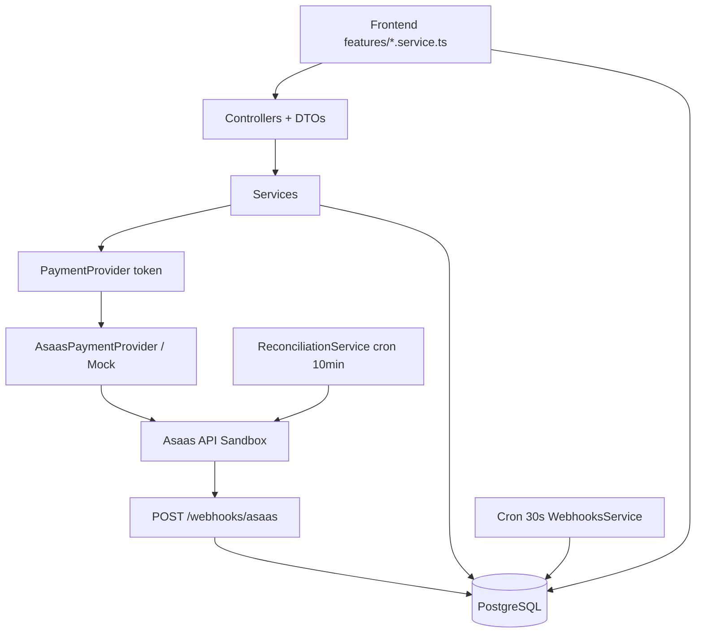

# Guia de Estudo — Asaas Payment Lab → Aluguel de Motos

Baseado no código real do repositório. Objetivo: dominar o necessário para adaptar pagamentos ao sistema de locação.

---

## Classificação de prioridade

| Nível | Assuntos |
|-------|----------|
| **OBRIGATÓRIO DOMINAR** | PaymentOrder vs Checkout vs Payment; webhook + idempotência; `PaymentProvider`; sync de Customer; fluxo PIX/cartão/assinatura; `externalReference`; reconciliação |
| **IMPORTANTE ENTENDER** | Schema Prisma; guards JWT/Roles; mappers em `shared/utils`; pause/resume/cancel; estorno; cron de webhook |
| **PODE APENAS CONSULTAR** | Admin dashboard; seed; páginas de audit/settings; deploy Vercel |
| **NÃO É PRIORIDADE AGORA** | Parcelamento (produto inativo — Checkout não suporta); CSS/Tailwind; mock provider (só para testes locais) |

---

## Mapa da arquitetura

```text
Monorepo npm workspaces
├── apps/api/          NestJS 11 + Fastify + Prisma + PostgreSQL
├── apps/web/          Next.js 16 (App Router)
└── packages/shared/     Enums, tipos, mappers, PaymentProvider interface
```



| Camada | Arquivos-chave | O que saber | Erro comum | No aluguel |
|--------|----------------|-------------|------------|------------|
| Frontend | `apps/web/src/features/*` | Páginas só renderizam; API via services | Chamar Asaas direto do browser | `Rental` dispara `checkoutFlowService` |
| Controller | `*.controller.ts` | HTTP fino, validação DTO, `@Roles` | Regra de negócio no controller | Mesmo padrão |
| Service | `*.service.ts` | Orquestra Prisma + Provider + Audit | Confirmar pagamento no callback | Vincular `rentalId` no PaymentOrder |
| PaymentProvider | `asaas/asaas-payment.provider.ts` | Abstrai Asaas; facilita testes | Acoplar HTTP no service | Copiar módulo `asaas/` |
| Webhook | `webhooks/webhooks.service.ts` | Persistir → responder 2xx → processar depois | Processar tudo antes de responder | Crítico para liberar moto |
| Shared | `packages/shared/src/utils.ts` | Mappers e precedência de status | Duplicar enums front/back | Importar no projeto real |

---

## 15 arquivos essenciais

### 1. `apps/api/prisma/schema.prisma`
- **Responsabilidade:** modelo de dados financeiro
- **Por que:** entender PaymentOrder ≠ Payment ≠ Checkout
- **Conceitos:** relações, índices únicos (`asaasPaymentId`, `asaasEventId`, `idempotencyKey`)
- **Reutilizar:** estrutura base; adaptar com `rentalId`
- **Pergunta:** qual campo liga intenção de cobrança à cobrança real?

### 2. `packages/shared/src/types.ts`
- **Responsabilidade:** interface `PaymentProvider` e DTOs de integração
- **Por que:** contrato entre lab e Asaas
- **Conceitos:** inversão de dependência
- **Reutilizar:** interface inteira + inputs de Checkout
- **Pergunta:** quais métodos o provider expõe?

### 3. `packages/shared/src/utils.ts`
- **Responsabilidade:** `buildExternalReference`, mappers, `shouldAdvancePaymentStatus`
- **Por que:** evita regressão de status no webhook
- **Reutilizar:** mappers e precedência
- **Pergunta:** o que acontece se `RECEIVED` chegar antes de `CONFIRMED`?

### 4. `apps/api/src/asaas/asaas-http.client.ts`
- **Responsabilidade:** HTTP para Asaas (header `access_token`)
- **Por que:** único lugar com API Key
- **Reutilizar:** sim, quase intacto
- **Pergunta:** onde a API Key entra na requisição?

### 5. `apps/api/src/asaas/asaas-payment.provider.ts`
- **Responsabilidade:** implementa `PaymentProvider` (customers, checkouts, subscriptions, refund)
- **Por que:** payload real do Asaas (`POST /checkouts`, `chargeTypes`, `billingTypes`)
- **Reutilizar:** sim
- **Pergunta:** diferença entre `createPixCheckout` e `createRecurringCreditCardCheckout`?

### 6. `apps/api/src/customers/customers.service.ts`
- **Responsabilidade:** CRUD local + `sync()` + `ensureSynced()`
- **Funções-chave:** `sync()` (linha ~83), `ensureSynced()` (linha ~138)
- **Reutilizar:** padrão sync; adaptar para cliente da locadora
- **Pergunta:** por que não criar customer no Asaas no `create()` local?

### 7. `apps/api/src/payment-orders/payment-orders.service.ts`
- **Responsabilidade:** PIX e cartão único
- **Funções-chave:** `createPix()`, `createCreditCard()`, `createCheckout()` (privado, ~85)
- **Reutilizar:** fluxo idempotência + externalReference
- **Pergunta:** onde evita Checkout duplicado?

### 8. `apps/api/src/subscriptions/subscriptions.service.ts`
- **Responsabilidade:** assinatura mensal + pause/resume/cancel
- **Funções-chave:** `createMonthly()`, `pause()`, `resume()`, `cancel()`
- **Reutilizar:** sim; ligar ao fim da locação
- **Pergunta:** por que assinatura começa `PENDING` e não `ACTIVE`?

### 9. `apps/api/src/payments/payments.service.ts`
- **Responsabilidade:** upsert webhook, reconcile, refund
- **Funções-chave:** `upsertFromWebhook()`, `reconcile()`, `refund()`
- **Reutilizar:** sim
- **Pergunta:** como evita Payment duplicado?

### 10. `apps/api/src/webhooks/webhooks.service.ts`
- **Responsabilidade:** receber, fila, processar eventos
- **Funções-chave:** `receive()`, `processPendingEvents()`, `handlePaymentEvent()`
- **Reutilizar:** arquitetura inteira
- **Pergunta:** por que responder 200 antes de processar?

### 11. `apps/api/src/reconciliation/reconciliation.service.ts`
- **Responsabilidade:** cron + `run()` compara local vs remoto
- **Reutilizar:** sim
- **Pergunta:** quando webhook falha, o que salva?

### 12. `apps/api/src/common/guards/roles.guard.ts`
- **Responsabilidade:** ADMIN vs VIEWER
- **Reutilizar:** padrão de autorização
- **Pergunta:** VIEWER pode criar Checkout?

### 13. `apps/web/src/features/checkout-flow/checkout-flow.service.ts`
- **Responsabilidade:** front chama PIX/cartão/assinatura
- **Reutilizar:** padrão service no front
- **Pergunta:** qual endpoint cada fluxo usa?

### 14. `apps/web/src/app/(dashboard)/checkout/new/page.tsx`
- **Responsabilidade:** UI de criação de Checkout
- **Reutilizar:** fluxo UX; adaptar para locação
- **Pergunta:** por que cliente não sincronizado fica disabled?

### 15. `apps/web/src/app/(dashboard)/payments/[id]/page.tsx`
- **Responsabilidade:** detalhe + reconcile + refund (admin)
- **Reutilizar:** padrão de detalhe financeiro
- **Pergunta:** quem pode estornar?

---

## Customer Asaas

```text
Cliente local (Customer)     → seu cadastro, CPF, email
Customer Asaas               → registro remoto, id = asaasCustomerId
```

| Campo | Função |
|-------|--------|
| `asaasCustomerId` | ID remoto; evita recriar no Asaas |
| `syncStatus` | PENDING / SYNCED / FAILED |
| `lastSyncError` | mensagem para retry manual |

**Fluxo real:**
```text
POST /customers/:id/sync
→ CustomersController.sync()
→ CustomersService.sync()
   ├─ se já tem asaasCustomerId → provider.updateCustomer()
   └─ senão → provider.createCustomer() → salva asaasCustomerId
```

**Duplicidade:** se `asaasCustomerId` existe, nunca chama `createCustomer` de novo.

**No aluguel:** cadastro do locatário local → sync antes de qualquer cobrança da locação.

---

## PaymentOrder vs Checkout vs Payment

| Entidade | O que é | Campos-chave |
|----------|---------|--------------|
| **PaymentOrder** | Intenção interna de cobrar | `amount`, `method`, `productId`, `idempotencyKey`, `externalReference` |
| **Checkout** | Sessão/link hospedado Asaas | `asaasCheckoutId`, `checkoutUrl`, `status`, `expiresAt` |
| **Payment** | Cobrança financeira real | `asaasPaymentId`, `internalStatus`, `renewalNumber` |

```text
PaymentOrder (1) ── Checkout (0..1)
PaymentOrder (1) ── Payment (0..N)   ← renovações geram N payments
Subscription (1) ── Payment (N)
```

**No aluguel:**
```text
Rental → PaymentOrder → Checkout (link pro cliente) → Payment (confirmado via webhook)
```

---

## PIX único — fluxo no código

1. **Front:** `checkout/new/page.tsx` → `checkoutFlowService.createPix()`
2. **DTO:** `payment-orders/dto/create-payment-order.dto.ts`
3. **Controller:** `PaymentOrdersController.createPix()` → `@Roles(ADMIN)`
4. **Service:** `PaymentOrdersService.createPix()` → `createCheckout(..., PIX)`
5. **Ordem:** cria PaymentOrder → `buildExternalReference('payment_order', id)`
6. **Checkout local:** `CheckoutsService.createRecord()`
7. **Asaas:** `provider.createPixCheckout()` → `POST /checkouts` com `billingTypes: ['PIX']`
8. **Persistência:** `markCreated()` + atualiza `checkoutUrl` na order
9. **Webhook:** `PAYMENT_*` → `handlePaymentEvent()` → `upsertFromWebhook()`
10. **UI:** `/payments` e `/payments/[id]`

**Callback (`/checkout/success`):** só UX — **não confirma pagamento**.

**Se webhook não chegar:** reconciliação (`ReconciliationService` cron 10min ou `POST /payments/:id/reconcile`).

**Checkout duplicado:** `idempotencyKey` + retorno da order existente se não terminal.

### Auto-teste PIX (5 perguntas)
1. O que valida `ensureSynced()` antes de criar Checkout?
2. Onde fica o `externalReference` enviado ao Asaas?
3. Qual evento webhook cria o `Payment`?
4. Por que successUrl não altera status?
5. O que impede dois Checkouts no double-click?

---

## Cartão único

Igual ao PIX até o provider — muda só:
- `CheckoutType.CREDIT_CARD_ONE_TIME`
- `provider.createCreditCardCheckout()` → `billingTypes: ['CREDIT_CARD']`
- Cartão digitado **só na página do Asaas** — lab nunca recebe PAN/CVV

| Parte | PIX | Cartão |
|-------|-----|--------|
| PaymentOrder | Igual | Igual |
| Checkout | `PIX_ONE_TIME` | `CREDIT_CARD_ONE_TIME` |
| Webhook | `PAYMENT_*` | `PAYMENT_*` (+ recusa: `PAYMENT_CREDIT_CARD_CAPTURE_REFUSED`) |
| Confirmação | CONFIRMED → RECEIVED | Idem + análise de risco possível |
| Falhas | OVERDUE, FAILED | Recusa no checkout |
| Estorno | `POST /payments/:id/refund` | Idem |
| Parcelamento | N/A | **Não implementado** (Checkout hospedado sem installment) |

---

## Assinatura mensal

```text
Produto SUBSCRIPTION
→ Subscription PENDING (local)
→ PaymentOrder SUBSCRIPTION_INITIAL
→ Checkout CREDIT_CARD_SUBSCRIPTION (chargeTypes: RECURRENT)
→ Cliente informa cartão no Asaas
→ Webhook SUBSCRIPTION_CREATED + PAYMENT_*
→ Subscription ACTIVE (só com evidência webhook, não ao criar checkout)
→ Cada mês: novo Payment com renewalNumber
```

**Arquivos:** `subscriptions.service.ts` (`createMonthly`), `webhooks.service.ts` (`handleSubscriptionEvent`, `handlePaymentEvent`).

**Renovação = novo Payment** porque cada cobrança tem `asaasPaymentId` único; upsert usa `asaasPaymentId` UNIQUE.

---

## Inativação / reativação / cancelamento

Estados locais (`SubscriptionStatus`): `PENDING → ACTIVE ↔ PAUSED → CANCELED`

| Ação | Asaas | Service | Local |
|------|-------|---------|-------|
| Pausar | `PUT /subscriptions/{id}` status INACTIVE | `pause()` | `PAUSED`, `pausedAt` |
| Reativar | status ACTIVE | `resume()` | `ACTIVE`, `resumedAt` |
| Cancelar | `DELETE /subscriptions/{id}` | `cancel(reason)` | `CANCELED`, `cancelReason` — histórico preservado |

Validações: exige `asaasSubscriptionId`; cancel exige motivo (DTO).

---

## Webhooks (parte crítica)

```text
Asaas → POST /webhooks/asaas (sem JWT, header asaas-access-token)
→ WebhooksService.receive() — valida token, dedup asaasEventId
→ INSERT WebhookEvent PENDING
→ HTTP 200 imediato
→ Cron 30s: processPendingEvents()
→ handleEvent() → upsert Payment / update Subscription
→ PROCESSED ou IGNORED (evento desconhecido) ou FAILED (retry backoff)
```

**Por que responder antes de processar:** Asaas reenvia se demorar; processamento pode falhar e precisa retry sem perder o evento.

**Arquivos:** `controllers/asaas-webhook.controller.ts`, `webhooks.service.ts`.

---

## Idempotência

| Cenário | Proteção |
|---------|----------|
| Double-click Checkout | `PaymentOrder.idempotencyKey` UNIQUE + retorno early |
| Webhook duplicado | `WebhookEvent.asaasEventId` UNIQUE |
| Payment duplicado | `Payment.asaasPaymentId` UNIQUE + upsert |
| externalReference | `PaymentOrder.externalReference` UNIQUE — liga webhook à order |

**Sem isso:** cobranças duplicadas, status inconsistente, moto liberada duas vezes.

---

## Reconciliação

```text
Local PENDING + Asaas RECEIVED → reconcile() → atualiza internalStatus
```

- **Arquivos:** `reconciliation.service.ts`, `payments.service.reconcile()`
- **Cron:** 10 minutos; lock `running` evita concorrência
- **Precedência:** `shouldAdvancePaymentStatus()` — nunca regride RECEIVED → PENDING
- **No aluguel:** fallback quando webhook cai ou ngrok expira

---

## Schema Prisma — entidades financeiras

| Modelo | Representa | Campos-chave | Adaptação aluguel |
|--------|------------|--------------|-------------------|
| Customer | Locatário | `asaasCustomerId`, `syncStatus` | + dados contrato |
| Product | Modalidade cobrança | `type`, `price`, `billingCycle` | plano por tipo de moto |
| PaymentOrder | Intenção cobrar locação | `rentalId` (futuro), `idempotencyKey` | FK Rental |
| Checkout | Link pagamento | `checkoutUrl`, `asaasCheckoutId` | enviar por WhatsApp/email |
| Payment | Cobrança real | `asaasPaymentId`, `renewalNumber` | trigger liberar moto |
| Subscription | Recorrência mensal | `asaasSubscriptionId`, `nextDueDate` | duração da locação |
| WebhookEvent | Fila eventos | `asaasEventId`, `status`, `attempts` | igual |
| AuditLog | Auditoria | `action`, `correlationId` | igual |

---

## Segurança

| Proteção | Onde | Produção |
|----------|------|----------|
| API Key backend | `AsaasHttpClient` + `.env` | OK |
| Webhook token | `WebhooksService.validateToken()` timing-safe | OK |
| JWT | `JwtAuthGuard`, `auth.service.ts` | OK |
| ADMIN/VIEWER | `RolesGuard` + `@Roles()` | OK |
| CORS | `bootstrap.ts` → `webUrl` | OK |
| Helmet | `bootstrap.ts` | OK |
| DTO whitelist | `ValidationPipe` global | OK |
| Logs sanitizados | `sanitizeForLog()` shared | OK |
| Cartão | nunca persiste — Checkout Asaas | OK |
| Rate limiting | **não implementado** | Pendente |
| Deploy cron Vercel | **frágil** | Usar servidor persistente |

---

## Frontend — páginas para estudar

| Página | Service | Ação principal |
|--------|---------|----------------|
| `/login` | `authService.login` | JWT no localStorage |
| `/checkout/new` | `checkoutFlowService` | Cria PIX/cartão/assinatura |
| `/checkouts/[id]` | `checkoutsService` | Detalhe + reconcile |
| `/payments`, `/payments/[id]` | `paymentsService` | Lista, reconcile, refund |
| `/subscriptions/[id]` | `subscriptionsService` | pause/resume/cancel |
| `/webhooks` | `adminService` | Lista + reprocess |
| `/sandbox` | `adminService.sandbox` | Ferramentas ADMIN |

Autorização: `useAuth().isAdmin` + `RoleGuard`; backend sempre valida com `@Roles`.

---

## Testes existentes

| Arquivo | O que prova |
|---------|-------------|
| `packages/shared/src/utils.test.ts` | Mappers, precedência status, sanitize |
| `apps/api/src/webhooks/webhooks.service.test.ts` | Validação token webhook |
| `apps/api/test/health-webhook.e2e.test.ts` | Endpoint webhook + auth e2e |

**Faltam (prioridade):** fluxo PIX mock end-to-end; idempotência webhook; upsert Payment; cancel subscription; reconcile divergência.

---

## Adaptação aluguel

| Lab | Aluguel |
|-----|---------|
| Customer | Cliente locatário |
| Product | Modalidade/plano |
| PaymentOrder | Intenção cobrança da locação |
| Checkout | Link enviado ao cliente |
| Payment | Pagamento confirmado |
| Subscription | Mensalidade da locação |
| WebhookEvent | Evento financeiro |
| AuditLog | Auditoria |

**Copiar/extrair:** `AsaasModule`, `PaymentProvider`, `AsaasPaymentProvider`, webhooks, reconciliação, mappers, padrão DTO/Service.

**Adaptar:** FK `rentalId`; valor dinâmico; cancelar recorrência ao encerrar locação; inadimplência → bloqueio moto; caução manual (fora Asaas).

**Não copiar cegamente:** seed, páginas admin do lab, deploy Vercel da API.

---

## Roteiro 5–7 dias

### Etapa 1 — Visão geral (dia 1)
- Ler: `schema.prisma`, `app.module.ts`, `packages/shared/src/types.ts`
- Exercício: desenhar fluxo Frontend→Asaas→Webhook→DB
- Evidência: explicar monorepo em 5 minutos

### Etapa 2 — Pagamento único (dias 2–3)
- Ler: `payment-orders.service.ts`, `asaas-payment.provider.ts`, `checkout/new/page.tsx`
- Exercício: trace PIX no código linha a linha
- Evidência: responder auto-teste PIX

### Etapa 3 — Assinatura (dia 4)
- Ler: `subscriptions.service.ts`, `handleSubscriptionEvent`
- Exercício: listar diferenças Subscription vs PaymentOrder
- Evidência: explicar por que renovação = novo Payment

### Etapa 4 — Confiabilidade (dias 5–6)
- Ler: `webhooks.service.ts`, `payments.service.ts`, `reconciliation.service.ts`, `utils.ts`
- Exercício: simular webhook duplicado no papel
- Evidência: explicar persist-before-process

### Etapa 5 — Adaptação (dia 7)
- Ler: `docs/RENTAL_PROJECT_INTEGRATION.md`
- Exercício: esboçar schema `Rental` + FKs
- Evidência: tabela Lab→Aluguel preenchida por você

---

## 20 perguntas (tente responder antes de ver respostas)

1. Por que callback não confirma pagamento?
2. Diferença PaymentOrder vs Payment?
3. Como evitar Checkout duplicado?
4. Como renovação vira novo Payment?
5. Webhook chega duas vezes — o que acontece?
6. Por que reconciliação existe?
7. Onde fica a API Key?
8. Cancelar assinatura apaga histórico?
9. O que é `asaasCustomerId`?
10. Quando sync falha, o que fazer?
11. Quem pode estornar?
12. VIEWER pode criar Checkout?
13. O que é `externalReference`?
14. Assinatura fica ACTIVE ao criar Checkout?
15. Onde cartão é digitado?
16. Evento desconhecido no webhook?
17. O que impede status regredir?
18. Parcelamento funciona no lab?
19. Caução passa pelo Asaas?
20. O que liberaria a moto no sistema real?

---

<details>
<summary>Respostas (esconder até tentar)</summary>

1. Callback é só UX; confirmação financeira vem do Asaas via webhook/reconciliação.
2. PaymentOrder = intenção; Payment = cobrança real com `asaasPaymentId`.
3. `idempotencyKey` UNIQUE + retorno da order existente.
4. Cada cobrança mensal tem novo `asaasPaymentId`; upsert por esse ID.
5. Segundo evento: `asaasEventId` duplicado → 200, sem efeito extra.
6. Webhook pode falhar/atrasar; reconciliação consulta fonte da verdade.
7. `.env` → `AsaasHttpClient` (nunca no front).
8. Não; `status=CANCELED`, histórico e payments preservados.
9. ID do customer no Asaas; evita duplicar remoto.
10. `syncStatus=FAILED`, `lastSyncError`; operador clica sync de novo.
11. ADMIN via `POST /payments/:id/refund`.
12. Não; `@Roles(ADMIN)` retorna 403.
13. String única `payment_order_{uuid}` ligando order ao webhook.
14. Não; fica PENDING até webhook/evidência Asaas.
15. Página Checkout hospedada do Asaas.
16. Marcado `IGNORED` em `WebhookEvent`.
17. `shouldAdvancePaymentStatus()` em `shared/utils.ts`.
18. Não; produto parcelado inativo no seed.
19. Não no MVP; registro manual.
20. Webhook/reconcile confirma Payment → regra de negócio atualiza Rental.

</details>

---

## Resumo final

### O essencial (10 conceitos)
1. PaymentOrder / Checkout / Payment
2. Customer local vs `asaasCustomerId`
3. Checkout hospedado (sem dados de cartão)
4. Webhook persist-before-process
5. Idempotência (eventId, paymentId, idempotencyKey)
6. Precedência de status
7. Reconciliação como rede de segurança
8. PaymentProvider como abstração
9. externalReference como elo webhook↔order
10. Assinatura ACTIVE só com evidência remota

### O que não precisa decorar
- Estrutura exata de páginas admin
- Comandos Docker/npm
- Enums completos do Asaas
- Config Vercel

### Maior risco técnico
**Webhook + idempotência + timing de confirmação** — liberar moto antes de Payment confirmado.

### Prontidão necessária
**INTERMEDIÁRIO → PRONTO PARA IMPLEMENTAR COM REVISÃO** após completar o roteiro e responder as 20 perguntas.

### Próxima tarefa prática (uma só)
Abra `apps/api/src/payment-orders/payment-orders.service.ts`, método `createCheckout()`, e anote em papel cada passo do PIX até `provider.createPixCheckout()` — depois faça o mesmo para `subscriptions.service.ts#createMonthly()` e compare as diferenças.
